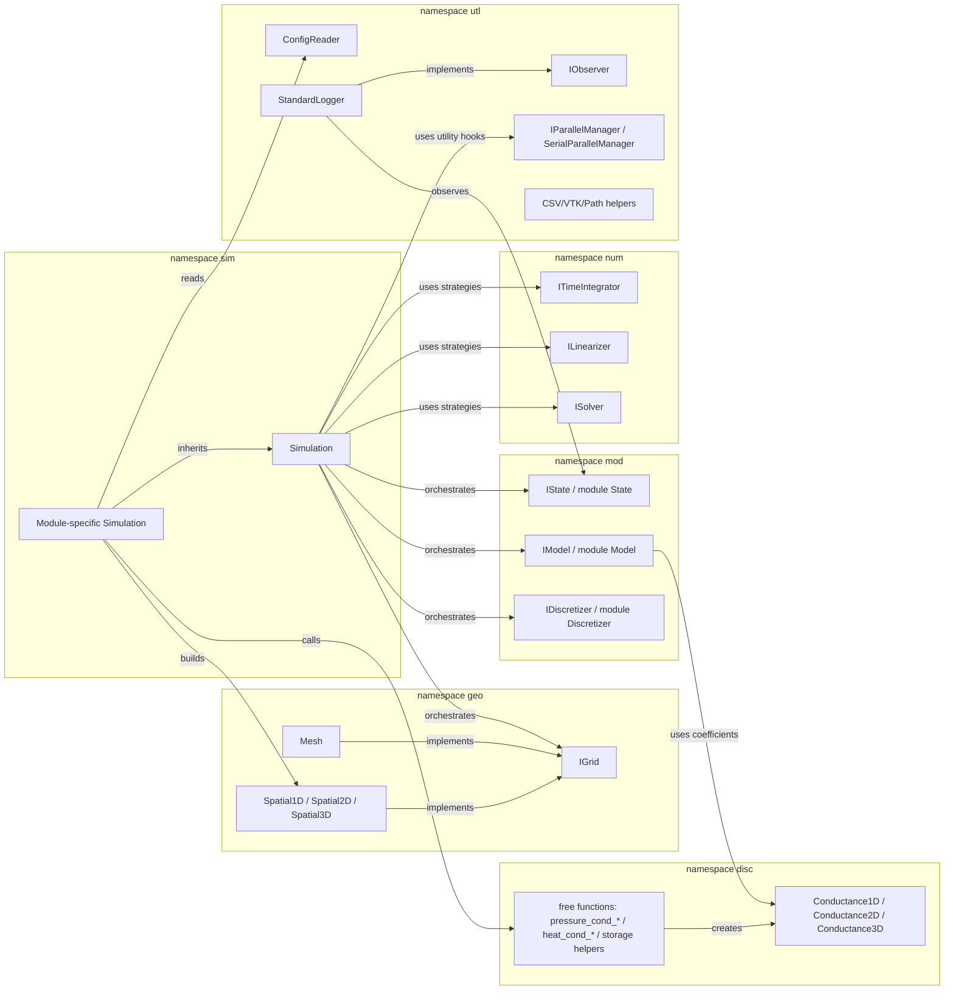

# System Architecture Reference

This document outlines the architectural design and software engineering patterns governing the **AXSCNT** (Advanced X-Simulation Component-Based Numerical Tool) engine.

## 🏛️ Core Design Philosophy

The project follows a **Component-Based Architecture** designed for high-performance numerical simulations. The primary goal is the strict separation of **Physical Governing Equations** from **Numerical Approximation Strategies**.

### 1. Dependency Inversion Principle
The framework defines abstract interfaces (contracts) across the `geo`, `mod`, `num`, and `utl` namespaces. Physics modules implement these interfaces without knowing which numerical solver will be used.
*   **Framework Layer**: Defines `IGrid`, `IModel`, `IDiscretizer`, `IState`, `ITimeIntegrator`, etc.
*   **Implementation Layer**: Concrete classes like `Pressure1DModel` or `NewtonRaphson`.

### 2. Strategy Pattern (Plug-and-Play Numerics)
Numerical tools such as `ITimeIntegrator` and `ISolver` are swappable strategies. You can switch from `ImplicitEuler` to `RungeKutta` or from `LinearTridiagonal` to `BiCGSTAB` by simply changing the configuration in the Simulation Factory.

### 3. Simulation Factory & Orchestrator
The `sim::Simulation` base class acts as both a **Factory** (assembling the specific module) and an **Orchestrator** (managing the time-stepping loop).

---

## 📂 Namespace Organization

| Namespace | Responsibility | Primary Components |
| :--- | :--- | :--- |
| **`geo`** | **Geometry & Topology** | `IGrid`, `Spatial1D`, `Spatial2D`, `Spatial3D`, `Mesh` |
| **`mod`** | **Physics & Logic** | `IModel`, `IState`, `IDiscretizer`, `ISourceSink`, module states/models/discretizers |
| **`disc`** | **Discretization Coefficients** | `Conductance1D`, `Conductance2D`, `Conductance3D`, `pressure_cond_*`, `heat_cond_*`, storage helpers |
| **`num`** | **Numerical Engines** | `ISolver`, `ITimeIntegrator`, `ILinearizer`, solver/integrator/linearizer implementations |
| **`sim`** | **Orchestration** | `Simulation`, `SimulationEngine`, module-specific simulation subclasses |
| **`utl`** | **Infrastructure** | `ConfigReader`, `IObserver`, `StandardLogger`, `IParallelManager`, `SerialParallelManager`, exporters, path helpers |

---

## Namespace Boundaries

AXSCNT uses C++ namespaces as architectural boundaries. New code should follow the same ownership rule as the existing source:

| Namespace | Source examples | Boundary rule |
| :--- | :--- | :--- |
| `sim` | `src/lib/simulation.hpp`, `src/modules/*/*/simulation.hpp` | Owns orchestration: build factories, run loops, and module-specific simulation subclasses. |
| `geo` | `src/lib/interfaces.hpp`, `src/lib/spatial.hpp`, `src/lib/fem.hpp` | Owns spatial contracts and geometry/topology containers. A grid may be structured (`Spatial1D`) or unstructured (`Mesh`), but it is not owned by a physics module. |
| `mod` | `src/lib/interfaces.hpp`, `src/modules/*/*/{state,model}.hpp` | Owns domain contracts and domain implementations: states, models, discretizers, and sources. |
| `disc` | `src/lib/discretization.hpp` | Owns shared coefficient containers and helper builders where geometry, material properties, and discretization formulas intersect. |
| `num` | `src/lib/{integrators,linearizers,solvers}.hpp` | Owns numerical algorithms and strategy implementations. |
| `utl` | `src/lib/interfaces.hpp`, `src/lib/engine_infra.hpp`, `src/lib/utils/{config_reader,logger,io,path}.hpp` | Owns infrastructure around configuration, observation, logging, parallel coordination hooks, export, and paths. |

---

## Framework Class Diagram

This diagram is intentionally framework-level. It shows the reusable contracts, strategy interfaces, default numerical implementations, and the aggregation points owned by `sim::Simulation`. Domain subclasses such as `PressureSimulation` belong in their module documentation.

The `disc` namespace also contains free helper functions such as `disc::pressure_cond_1d()` and `disc::pressure_storage()`. They are described in text instead of modeled as classes because they are not source-level types.

```mermaid
classDiagram
    direction TB

    namespace sim {
        class Simulation {
            <<abstract>>
            #grd: shared_ptr~IGrid~
            #mdl: shared_ptr~IModel~
            #discretizer: shared_ptr~IDiscretizer~
            #timer: shared_ptr~ITimeIntegrator~
            #linearizer: shared_ptr~ILinearizer~
            #solver: shared_ptr~ISolver~
            #parallel: shared_ptr~IParallelManager~
            #sources: vector~shared_ptr~ISourceSink~~
            #observers: vector~shared_ptr~IObserver~~
            +build(config: ConfigReader)*
            +step(t: double, dt: double, st_curr: IState)
            +run(t_max: double, dt_initial: double, st_init: unique_ptr~IState~)
            +add_observer(obs: shared_ptr~IObserver~)
        }
        class SimulationEngine {
            <<compatibility>>
            +build(config: ConfigReader)
        }
    }

    namespace geo {
        class IGrid { <<interface>> }
        class Spatial1D
        class Spatial2D
        class Spatial3D
        class Mesh
    }

    namespace mod {
        class IState { <<interface>> }
        class IModel { <<interface>> }
        class IDiscretizer { <<interface>> }
        class ISourceSink { <<interface>> }
    }

    namespace disc {
        class Conductance1D
        class Conductance2D
        class Conductance3D
    }

    namespace num {
        class ITimeIntegrator { <<interface>> }
        class ILinearizer { <<interface>> }
        class ISolver { <<interface>> }
        class ImplicitEulerIntegrator
        class ForwardEulerIntegrator
        class RungeKutta4Integrator
        class FullyImplicitIntegrator
        class NewtonRaphson
        class ExplicitLinearizer
        class LUSolver
        class LinearTridiagonalSolver
        class BiCGSTABSolver
        class ConjugateGradientSolver
    }

    namespace utl {
        class ConfigReader
        class IObserver { <<interface>> }
        class IParallelManager { <<interface>> }
        class StandardLogger
        class SerialParallelManager
    }

    Simulation <|-- SimulationEngine
    IGrid <|.. Spatial1D
    IGrid <|.. Spatial2D
    IGrid <|.. Spatial3D
    IGrid <|.. Mesh
    Simulation o-- IGrid
    Simulation o-- IModel
    Simulation o-- IDiscretizer
    Simulation o-- ITimeIntegrator
    Simulation o-- ILinearizer
    Simulation o-- ISolver
    Simulation o-- IParallelManager
    Simulation o-- ISourceSink
    Simulation o-- IObserver
    Simulation ..> IState : run/step state
    Simulation ..> ConfigReader : build input

    ITimeIntegrator <|.. ImplicitEulerIntegrator
    ITimeIntegrator <|.. ForwardEulerIntegrator
    ITimeIntegrator <|.. RungeKutta4Integrator
    ImplicitEulerIntegrator <|-- FullyImplicitIntegrator
    ILinearizer <|.. NewtonRaphson
    ILinearizer <|.. ExplicitLinearizer
    ISolver <|.. LUSolver
    ISolver <|.. LinearTridiagonalSolver
    ISolver <|.. BiCGSTABSolver
    ISolver <|.. ConjugateGradientSolver
    IParallelManager <|.. SerialParallelManager
    IObserver <|.. StandardLogger
```

---

## 📊 Module Blueprints

Module diagrams are maintained in **Mermaid** format inside the module documentation. They should focus on domain-specific classes, equations, parameters, and subclass relationships.

### High-Fidelity Module Blueprints:
*   [**Pressure 1D Architecture**](./modules/pressure_1d.md#class-diagram)
*   [**Oscillator Architecture**](./modules/oscillator.md#class-diagram)
*   [**Heat 1D Architecture**](./modules/heat_1d.md#class-diagram)
*   [**Wave 1D Architecture**](./modules/wave_1d.md#class-diagram)
*   [**Burgers Architecture**](./modules/burgers.md#class-diagram)
*   [**Fluid Dynamics Architecture**](./modules/fluid_dynamics.md#class-diagram)

> [!TIP]
> **How to edit diagrams**: Mermaid diagrams are text-based and reside inside the `.md` files. You can update them using any text editor, and they will render automatically in GitHub or VS Code.

---

## 🧬 Simulation Lifecycle

1.  **Configuration**: `ConfigReader` parses the simulation parameters.
2.  **Build Phase**: The specialized `Simulation::build()` method instantiates the specific Model, Discretizer, and Numerical Strategy.
3.  **Initialization**: `create_initial_state()` prepares the variables (e.g., initial pressure field).
4.  **Run Loop**:
    *   `Simulation::step()` is called iteratively.
    *   `ILinearizer` (e.g., Newton-Raphson) resolves the non-linear system.
    *   `IDiscretizer` assembles the Jacobian and Residual.
    *   `ISolver` performs the matrix inversion.
5.  **Output**: `IObserver` instances handle data logging and visualization exports.

---

## 🔗 Related Documentation
*   [README.md](../README.md) - Project Overview & Setup.
*   [Module: Pressure 1D](./modules/pressure_1d.md) - Physical and numerical derivation.
