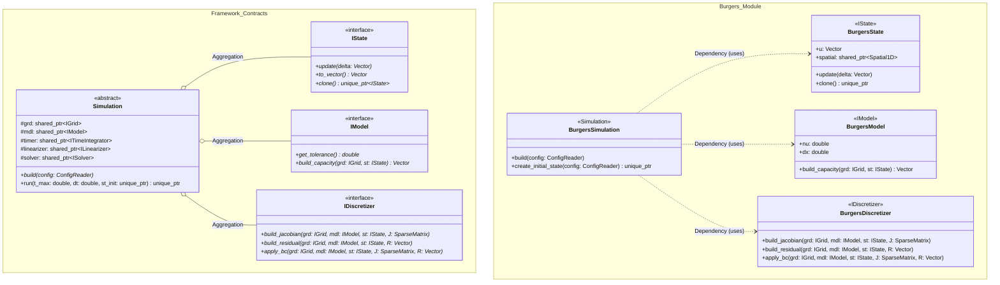

# Burgers Equation Module

Simulates non-linear advection-diffusion using the Burgers equation.

## Class Diagram

```mermaid
classDiagram
    direction TB

    namespace Framework_Contracts {
        class IState {
            <<interface>>
            +update(delta: Vector)*
            +to_vector() Vector*
            +clone() unique_ptr~IState~*
        }
        class IModel {
            <<interface>>
            +get_tolerance() double*
            +build_capacity(grd: IGrid, st: IState) Vector*
        }
        class IDiscretizer {
            <<interface>>
            +build_jacobian(grd: IGrid, mdl: IModel, st: IState, J: SparseMatrix)*
            +build_residual(grd: IGrid, mdl: IModel, st: IState, R: Vector)*
            +apply_bc(grd: IGrid, mdl: IModel, st: IState, J: SparseMatrix, R: Vector)*
        }
        class Simulation {
            <<abstract>>
            #grd: shared_ptr~IGrid~
            #mdl: shared_ptr~IModel~
            #timer: shared_ptr~ITimeIntegrator~
            #linearizer: shared_ptr~ILinearizer~
            #solver: shared_ptr~ISolver~
            +build(config: ConfigReader)*
            +run(t_max: double, dt: double, st_init: unique_ptr) unique_ptr
        }
    }

    namespace Burgers_Module {
        class BurgersState {
            <<IState>>
            +u: Vector
            +spatial: shared_ptr~Spatial1D~
            +update(delta: Vector)
            +clone() unique_ptr
        }
        class BurgersModel {
            <<IModel>>
            +nu: double
            +dx: double
            +build_capacity(grd: IGrid, st: IState) Vector
        }
        class BurgersDiscretizer {
            <<IDiscretizer>>
            +build_jacobian(grd: IGrid, mdl: IModel, st: IState, J: SparseMatrix)
            +build_residual(grd: IGrid, mdl: IModel, st: IState, R: Vector)
            +apply_bc(grd: IGrid, mdl: IModel, st: IState, J: SparseMatrix, R: Vector)
        }
        class BurgersSimulation {
            <<Simulation>>
            +build(config: ConfigReader)
            +create_initial_state(config: ConfigReader) unique_ptr
        }
    }

    %% Relationships
    Simulation o-- IModel : Aggregation
    Simulation o-- IDiscretizer : Aggregation
    Simulation o-- IState : Aggregation
    
    BurgersSimulation ..> BurgersModel : Dependency (uses)
    BurgersSimulation ..> BurgersState : Dependency (uses)
    BurgersSimulation ..> BurgersDiscretizer : Dependency (uses)
```
