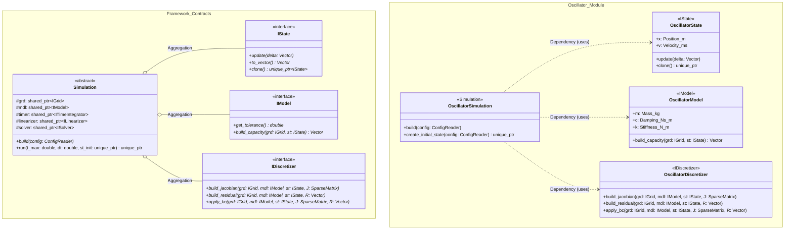

# Harmonic Oscillator Module

The Harmonic Oscillator serves as the "Hello World" of AXSCNT, demonstrating the 0D ODE integration within the framework.

## Class Diagram

## Physics Equations

- $dx/dt = v$
- $m \cdot dv/dt + c \cdot v + k \cdot x = 0$
