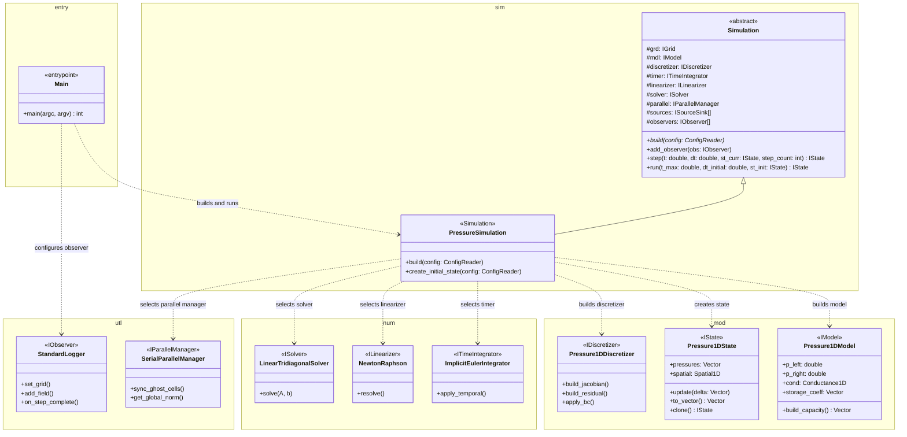

# 1D Pressure Diffusivity Module

This module simulates pressure transient behavior in porous media using a Finite Volume Method (FVM) discretization. It demonstrates the framework's ability to handle domain-specific properties like permeability and porosity within the standardized simulation pipeline.

## Configuration Flow

Configuration is split between the executable entry point and the pressure simulation factory:

1. `main.cpp` chooses the input file, loads it with `ConfigReader`, sets OpenMP threads, configures `StandardLogger`, creates the initial state, and calls `Simulation::run()`.
2. `PressureSimulation::build()` translates pressure-specific config values into framework components and fixed numerical strategies.
3. `PressureSimulation::create_initial_state()` uses the configured grid and `p_initial` to create the starting pressure field.

| Config key(s) | Input value / code fallback | Consumed by | Configures |
| :--- | :--- | :--- | :--- |
| input path | first positional CLI argument, otherwise `input/pressure_1d.txt` | `main.cpp` | Which config file is loaded. |
| `num_threads` | fallback `4` | `main.cpp` | OpenMP thread count via `omp_set_num_threads()`. |
| `nx`, `dx` | `50`, `10.0` / `100`, `10.0` | `PressureSimulation::build()` | `geo::Spatial1D(nx, dx)` grid. |
| `k`, `mu`, `area`, `dx` | `100.0`, `1.0`, omitted, `10.0` / `50.0`, `1.0`, `100.0`, `10.0` | `PressureSimulation::build()` | `disc::pressure_cond_1d()` and the model's `Conductance1D`. |
| `phi`, `ct`, `dx`, `area` | `0.2`, `1e-4`, `10.0`, omitted / `0.2`, `1e-6`, `10.0`, `100.0` | `PressureSimulation::build()` | `disc::pressure_storage()` and the model's storage vector. |
| `p_left`, `p_right` | fallbacks `3000.0`, `1000.0` | `PressureSimulation::build()` | Dirichlet boundary pressure values stored by `Pressure1DModel`. |
| `p_initial` | fallback `2000.0` | `PressureSimulation::create_initial_state()` | Initial `Pressure1DState` pressure vector. |
| `dt`, `t_end` | `0.1`, `5.0` / `0.1`, `5.0` | `main.cpp` | Runtime call `sim.run(t_end, dt, state)`. |
| `export_dir`, `project_name`, `enable_vtk`, `enable_csv` | `exports`, `pressure_1d`, `1`, `1` / `exports`, `sim`, `0`, `0` | `main.cpp` and `StandardLogger` | Output directory, project folder, and export formats. |
| `enable_json` | `0` / not consumed | none | Present in the input file, but no current component reads it. |
| `log_frequency`, `export_frequency` | fallbacks `10`, `50` | `StandardLogger` | Terminal and file-output cadence. |

The numerical strategy is currently selected in code rather than through input keys: `ImplicitEulerIntegrator`, `NewtonRaphson(1e-6, 12, true)`, `LinearTridiagonalSolver`, and `SerialParallelManager` are fixed choices inside `PressureSimulation::build()`.

## Class Diagram

This diagram stays at the module assembly layer and keeps the same namespace boundaries used by the source code: `sim` for orchestration, `geo` for grid geometry, `mod` for pressure-domain objects, `disc` for coefficient builders, `num` for selected numerical strategies, and `utl` for observation and parallel coordination. Stereotypes such as `<<IModel>>` indicate which framework contract a pressure-specific class implements. Framework-level aggregation between `Simulation` and reusable interfaces is documented in [System Architecture Reference](../architecture.md#framework-class-diagram).

`geo::Spatial1D` and `disc::Conductance1D` are shown as attribute types to preserve dependency visibility without adding separate class nodes. Ownership details such as `shared_ptr` and `unique_ptr` are omitted from the diagram.

## Pressure Module Wiring

`PressureSimulation::build()` chooses the reusable framework components needed for this domain:

| Concern | Pressure 1D choice |
| :--- | :--- |
| Grid | `geo::Spatial1D(nx, dx)` |
| Model | `Pressure1DModel(cond, storage, p_left, p_right)` |
| Discretizer | `Pressure1DDiscretizer` |
| Time integration | `ImplicitEulerIntegrator` |
| Nonlinear/linearized step | `NewtonRaphson(1e-6, 12, true)` |
| Algebraic solve | `LinearTridiagonalSolver` |
| Parallel manager | `SerialParallelManager` |

### Numerical Configuration Details

The grid lives in `namespace geo`, shared conductance/storage helpers live in `namespace disc`, numerical algorithms live in `namespace num`, and parallel/observer hooks live in `namespace utl`. The pressure simulator chooses this stack because the pressure system is a 1D implicit diffusion problem with a tridiagonal spatial operator.

| Framework slot | Configured class | Interface | Pressure-specific reason |
| :--- | :--- | :--- | :--- |
| Time integration | `ImplicitEulerIntegrator` | `ITimeIntegrator` | Adds the accumulation term `storage * (p_new - p_old) / dt`, which is stable for diffusive pressure transients. |
| Linearization | `NewtonRaphson(1e-6, 12, true)` | `ILinearizer` | Runs the assemble-solve-update loop with a residual tolerance of `1e-6` and up to 12 iterations. For this linear pressure equation it usually converges quickly, but it still uses the common nonlinear engine path. |
| Algebraic solver | `LinearTridiagonalSolver` | `ISolver` | Matches the 1D nearest-neighbor stencil assembled by `Pressure1DDiscretizer`, where each cell only couples to its left and right neighbors. |
| Parallel manager | `SerialParallelManager` | `utl::IParallelManager` | Provides the framework hooks for ghost-cell sync and global residual norm while running this module in serial. |
| Discretization helpers | `disc::pressure_cond_1d`, `disc::pressure_storage` | `disc` helpers | Convert `k`, `mu`, `area`, `dx`, `phi`, and `ct` into transmissibility and storage vectors used by the pressure model. |

Per time step, the selected numerical stack runs in this order:

1. `NewtonRaphson` clones the old pressure state as the new-time guess.
2. `Pressure1DDiscretizer` assembles the spatial Jacobian and residual from the pressure field.
3. `Pressure1DDiscretizer::apply_bc()` pins the left and right Dirichlet pressures.
4. `ImplicitEulerIntegrator` adds the temporal accumulation terms to the residual and Jacobian diagonal.
5. `SerialParallelManager` computes the residual norm used for convergence.
6. `LinearTridiagonalSolver` solves `J * delta = -R`.
7. `Pressure1DState::update()` applies the pressure correction.

## Physics Equations

The governing equation for 1D pressure diffusivity is:

$$\phi c_t \frac{\partial p}{\partial t} = \frac{\partial}{\partial x} \left( \frac{k}{\mu} \frac{\partial p}{\partial x} \right) + q$$

Where:
- **Accumulation**: Handled by `Pressure1DModel::build_capacity` and the selected implicit time integrator.
- **Transmissibility**: Handled by `Pressure1DDiscretizer::build_jacobian` using the `cond` (conductance) array.
- **Boundary Conditions**: Handled by `Pressure1DDiscretizer::apply_bc` (typically Dirichlet for this module).

## Pressure Component Roles

- **PressureSimulation**: The specialized module orchestrator that handles its own assembly.
- **geo::Spatial1D**: Represents the linear grid of cells.
- **Pressure1DState**: Holds the pressure vector at each cell.
- **Pressure1DModel**: Stores permeability-based `disc::Conductance1D` and storage capacity.
- **Pressure1DDiscretizer**: Implements the central difference scheme for the Laplacian operator.
- **main.cpp**: The module entry point that chooses the config file, loads input, sets thread count, creates the pressure simulation, registers pressure output, and starts the run.

## Use Cases

Use cases describe concrete stories built on top of the same module configuration path. Additional scenarios can be added here as separate subsections, usually with their own input file, parameter story, expected behavior, and output settings.

### Use Case 1: Default 1D Reservoir Pressure Transient

The default scenario in `input/pressure_1d.txt` represents a homogeneous one-dimensional reservoir strip or laboratory core where pressure diffuses from a high-pressure side toward a low-pressure side. The grid has `nx = 50` cells with `dx = 10.0`, so the modeled flow path is 500 length units long. In reservoir-field interpretation, this is commonly read as 500 ft.

The rock and fluid settings describe a moderately permeable, compressible porous medium:

| Parameter | Value | Story in the model |
| :--- | :--- | :--- |
| `phi` | `0.2` | 20% of the bulk volume is pore volume available for fluid storage. |
| `k` | `100.0` | Permeability controls how easily pressure communicates between neighboring cells. |
| `mu` | `1.0` | Fluid viscosity; lower values make pressure diffuse faster for the same permeability. |
| `ct` | `1e-4` | Total compressibility; larger values increase storage and slow pressure response. |

The time controls tell the engine to advance the transient with an implicit step:

| Parameter | Value | Story in the model |
| :--- | :--- | :--- |
| `dt` | `0.1` | Each implicit Euler step advances the pressure field by 0.1 simulation time units. |
| `t_end` | `5.0` | The run stops after 5.0 time units, giving up to 50 pressure updates. |

Some physical values are intentionally supplied by `PressureSimulation` defaults when they are not written in the input file:

| Default parameter | Default value | Role |
| :--- | :--- | :--- |
| `p_initial` | `2000.0` | Initial uniform pressure in every cell. |
| `p_left` | `3000.0` | Fixed Dirichlet pressure at the left boundary. |
| `p_right` | `1000.0` | Fixed Dirichlet pressure at the right boundary. |
| `area` | `100.0` | Cross-sectional flow area used in transmissibility and storage. |

Together, these values describe a pressure-diffusion experiment: the domain starts at 2000 psi, the left boundary is held at 3000 psi, and the right boundary is held at 1000 psi. Over time the implicit solver relaxes the internal cells toward the boundary-driven pressure gradient.

The export settings make the run inspectable after execution:

| Parameter | Value | Effect |
| :--- | :--- | :--- |
| `export_dir` | `exports` | Root output directory. |
| `project_name` | `pressure_1d` | Subfolder name for this simulation's outputs. |
| `enable_vtk` | `1` | Writes VTK image data for visualization tools. |
| `enable_csv` | `1` | Writes CSV snapshots for lightweight inspection. |
| `enable_json` | `0` | Present in the input file, but not currently consumed by `StandardLogger`. |
