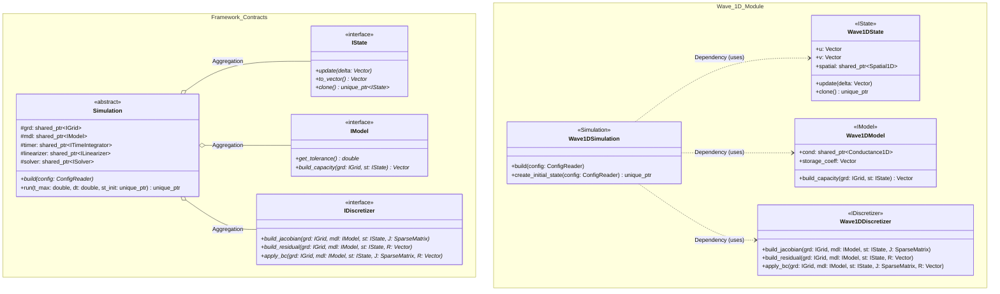

# 1D Wave Equation Module

Simulates acoustic wave propagation using a second-order hyperbolic PDE discretization.

## Class Diagram

```mermaid
classDiagram
    direction TB

    namespace Framework_Contracts {
        class IState {
            <<interface>>
            +update(delta: Vector)*
            +to_vector() Vector*
            +clone() unique_ptr~IState~*
        }
        class IModel {
            <<interface>>
            +get_tolerance() double*
            +build_capacity(grd: IGrid, st: IState) Vector*
        }
        class IDiscretizer {
            <<interface>>
            +build_jacobian(grd: IGrid, mdl: IModel, st: IState, J: SparseMatrix)*
            +build_residual(grd: IGrid, mdl: IModel, st: IState, R: Vector)*
            +apply_bc(grd: IGrid, mdl: IModel, st: IState, J: SparseMatrix, R: Vector)*
        }
        class Simulation {
            <<abstract>>
            #grd: shared_ptr~IGrid~
            #mdl: shared_ptr~IModel~
            #timer: shared_ptr~ITimeIntegrator~
            #linearizer: shared_ptr~ILinearizer~
            #solver: shared_ptr~ISolver~
            +build(config: ConfigReader)*
            +run(t_max: double, dt: double, st_init: unique_ptr) unique_ptr
        }
    }

    namespace Wave_1D_Module {
        class Wave1DState {
            <<IState>>
            +u: Vector
            +v: Vector
            +spatial: shared_ptr~Spatial1D~
            +update(delta: Vector)
            +clone() unique_ptr
        }
        class Wave1DModel {
            <<IModel>>
            +cond: shared_ptr~Conductance1D~
            +storage_coeff: Vector
            +build_capacity(grd: IGrid, st: IState) Vector
        }
        class Wave1DDiscretizer {
            <<IDiscretizer>>
            +build_jacobian(grd: IGrid, mdl: IModel, st: IState, J: SparseMatrix)
            +build_residual(grd: IGrid, mdl: IModel, st: IState, R: Vector)
            +apply_bc(grd: IGrid, mdl: IModel, st: IState, J: SparseMatrix, R: Vector)
        }
        class Wave1DSimulation {
            <<Simulation>>
            +build(config: ConfigReader)
            +create_initial_state(config: ConfigReader) unique_ptr
        }
    }

    %% Relationships
    Simulation o-- IModel : Aggregation
    Simulation o-- IDiscretizer : Aggregation
    Simulation o-- IState : Aggregation
    
    Wave1DSimulation ..> Wave1DModel : Dependency (uses)
    Wave1DSimulation ..> Wave1DState : Dependency (uses)
    Wave1DSimulation ..> Wave1DDiscretizer : Dependency (uses)
```
