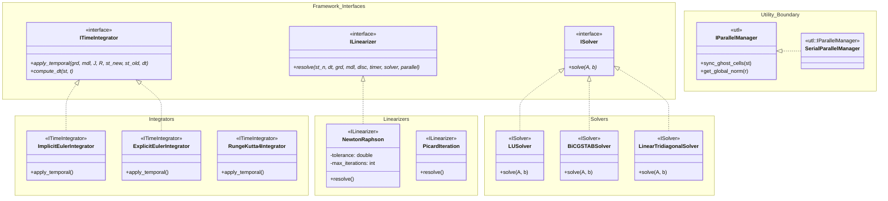

# Numerical Engine Architecture (`num`)

This document details the numerical strategies and solver implementations that power the AXSCNT simulation engine. The core philosophy is **Numerical Strategy Injection**, where solvers and integrators are treated as swappable components.

## Class Diagram

`IParallelManager` and `SerialParallelManager` are utility-layer hooks in `namespace utl`, but the numerical linearizers receive them so convergence checks and future distributed halo synchronization can use the same orchestration path.

## Numerical Strategies

### ⏱️ Time Integration
The engine supports both **Implicit** and **Explicit** schemes.
*   **Implicit Euler**: Preferred for stiff equations (like Heat and Pressure) as it is unconditionally stable.
*   **Explicit schemes**: Available for wave propagation or non-stiff dynamics.

### 📉 Linearization (Newton-Raphson)
For non-linear physics, the `NewtonRaphson` class implements the iterative process:
1.  **Assembly**: Calls `IDiscretizer` to build the Jacobian ($J$) and Residual ($R$).
2.  **Temporal Correction**: Calls `ITimeIntegrator` to inject mass-matrix terms.
3.  **Solve**: Calls `ISolver` to find the update $\delta = -J^{-1}R$.
4.  **Update**: Calls `IState` to apply the correction.

### 🧮 Linear Solvers
*   **Tridiagonal**: Optimized $O(N)$ solver for 1D structured problems.
*   **BiCGSTAB**: Iterative solver for large, sparse 2D/3D systems.
*   **LU**: Direct solver for small, dense, or specific sparse matrices.
